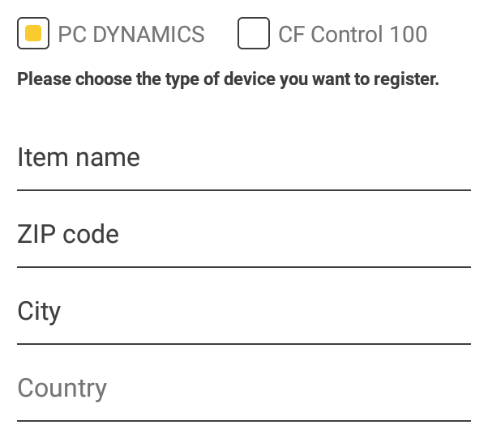
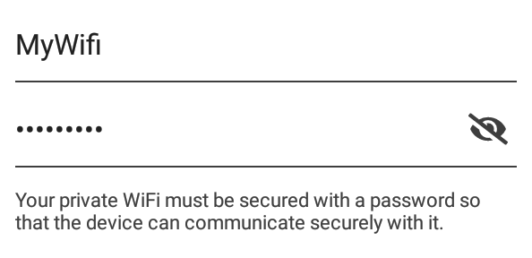
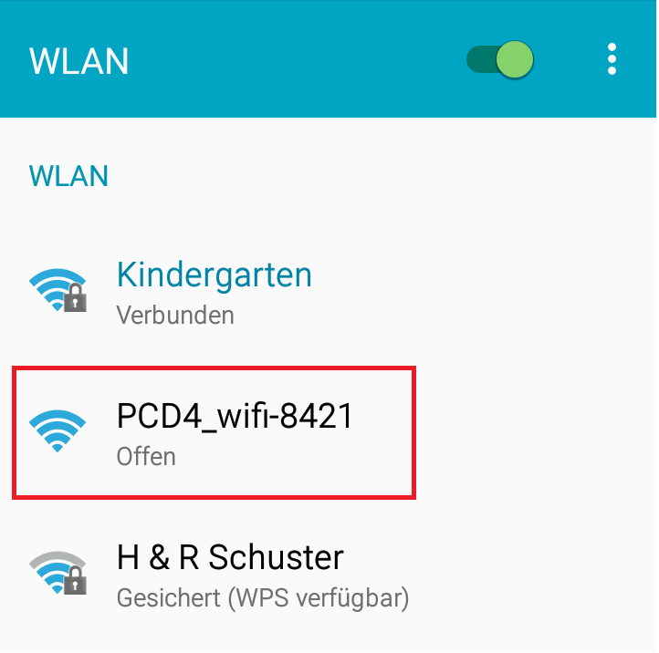
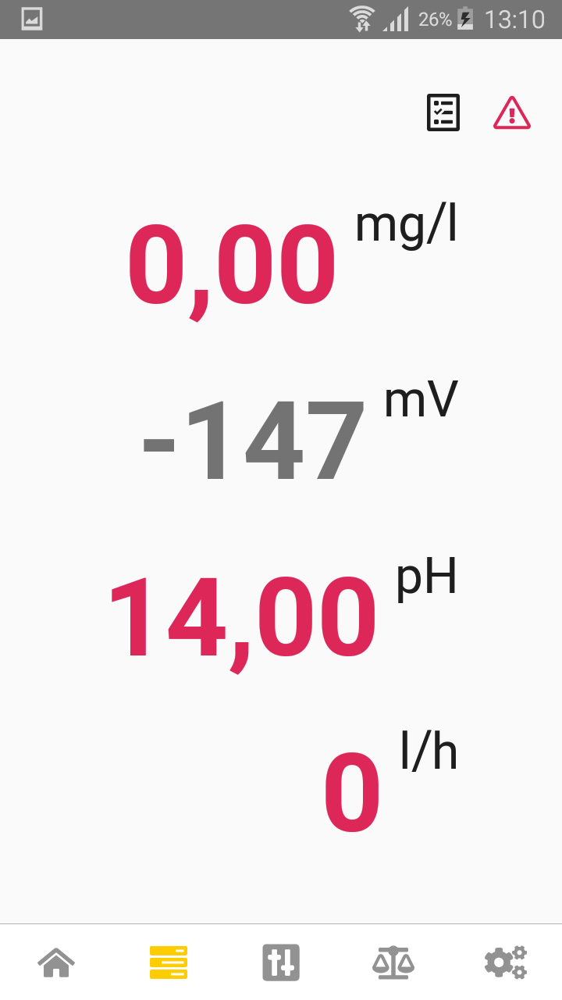

dinoAccess ist eine Smartphone App zur Steuerung und Visualisierung des PC Dynamics und CF100. Diese App ist für den Geräteinhaber gedacht und wird zwingend zur Konfiguration des Gerätes benötigt.

Nach erfolglreicher Einrichtung des PCDs über die App kann dieser auch im dinoRemote gesteuert und verwaltet werden.
Eine Freigabe des PC Dynamcics für den Fachhändler oder andere dinoRemote Nutzer, ähnlich wie bei dinotecNet+ Systemen, ist ebenfalls möglich.  Eine Kundenübersicht und derren Anlage ist für den Fachhändler über die dinoAccess App ist nicht möglich.

### Voraussetzungen
- Apple iPhone ab iOS9 oder Android Smartphone ab Android 6.0 (Marshmallow)
- Internetfähiger 2,4 Ghz Accesspoint in der Nähe des PC Dynamics oder CF100
- Aktiviertes DHCP im Kundennetzwerk
- Port 1883 und 3006 werdedn nicht von einer Firewall geblockt

### App Download
 

   
  

  
  [Apple](https://apps.apple.com/de/app/dinoaccess/id1474266309) oder [Android](https://play.google.com/store/apps/details?id=de.dinotec.dinoaccess)
   

  

### Erster Start

Sollten Sie bereits einen dinoRemote Account besitzen, so können Sie sich mit den selben Login-Daten anmelden. Umgekehrt geht dies übrigens auch, da dieselbe Benutzerdatenbank genutzt wird.

Die App leitet Sie intuitiv durch eine einfache Anleitung durch den Einrichtungsprozess. Lesen Sie diesen bitte Aufmerksam durch.

- Klicken Sie unten Rechts auf das gelbe Plus  um ein neues Gerät einzurichten.

- Wählen Sie den Geräte Typ aus, den Sie einrichten möchten und vervolllständigen Sie den Gerätenamen sowie die Adresse des Standorts. Klicken sie anschließend auf **Weiter**

   

- Geben Sie die Logindaten zu dem gewünschten WLan Accesspoint an, mit dem sich Ihr Gerät verbinden soll. Klicken sie anschließend auf **Weiter**

   

- Öffnen Sie nun die  Wlan Einstellung auf Ihrem Smartphone und suchen Sie nach dem offenen Hotspot (beginnend mit **PCD4** oder **CF100**, je nach Gerätetyp).

  

     
  

- Die App sendet nun die Informationen direkt an das Gerät, welches sich daraufhin mit dem eingetragenen Wlan verbindet und seine ersten Daten an den dinoRemote Server sendet. Dieser Vorgang kann ca 2-3 Minuten dauern. Schließen Sie die App in dieser Zeit nicht. Wenn das Gerät seine ersten Daten gesendet hat, wechselt die App automatisch in den Parameter Bilschirm der Anlage.
  

   

- **Die Einrichtung ist abgeschlossen**

### Problembehandlung

**Es wird kein Hotspot mit dem Namen "PCD4" oder "CF100 gefunden**  
Geben Sie den Code **800** im Gerät ein, um die Wifi Einstellungen zurückzusetzen.

**Während der Einrichtung bleibt die App bei "Warte auf Verbindung" stehen**  
Wählen Sie in ihren Wlan einstellungen des Smartphones den passenden WLan Hotspot aus.

**Während der Einrichtung bleibt die App bei "Warte auf erste Daten" stehen**
- Sie haben möglicherweise Ihre Wifi Zugangsddaten falsch eingegeben. Setzen Sie das Gerät mit Code ***800** zurück.
 Wechseln Sie in der App auf die Geräteübersicht, wählen Sie ihr Gerät aus, klicken Sie auf "Konfiguration fortsetzen" und gehen Sie die Schritte noch einmal sorgfältig durch.

- Die Wlan verbindung zum Kundenrouter ist zu schwach. Versuchen Sie dden Accesspoint näher zu Ihrem Gerät zu bringen. Nutzen Sie ggf. einen Wlan Repeater. Die WiFi Antenne des PCDs ist nicht zu vergleichen mit jene eines Smartphones oder Laptops!

- Das Netzwerk ist durch eine Firewall gesichert. Stellen Sie sicher das folgende Ports für das Gerät freigegeben sind:
  - 1883 (TCP)
  - 3006 (Websocket)
