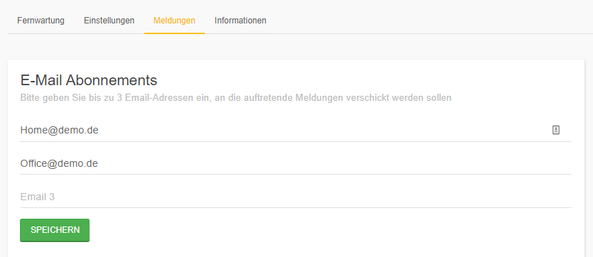
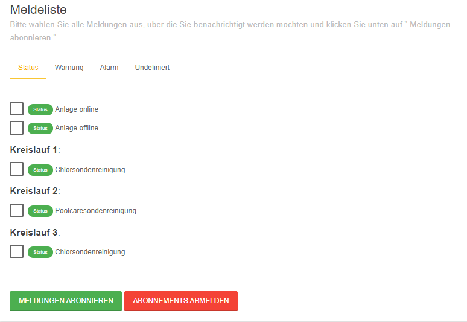

# Meldungen

Hier können Sie Ihre E-Mail Abonnements bearbeiten.
Tritt eine Meldung in der Anlage auf, so sendet dinoRemote die gewünschten Meldungen per E-Mail an die angebebenen E-Mail Adressen. Das System fasst mehrere Meldungen in einer Email zusammen und informiert zusätzlich darüber, welche Meldungen nicht mehr aktiv sind.
  
!> Ihr dinotec System überwacht zahlreiche Parameter und Funktionen, dementsprechend wird eine Vielzahl von Meldungen generiert.  
Oftmals werden diese Meldungen durch die intelligente Steuerung aufgelöst und/oder der Wasseraufbereitungskreislauf „schwingt“ sich nach einer gewissen Zeit wieder ein.  
Nur wenige Meldungen erfordern Ihr Handeln. Wir empfehlen Ihnen daher lediglich die für Sie wichtigsten Meldungen zu abonnieren.  
**Störung Filter**  
**Behälter unter Alarmwert**  
**Dosierzeitüberwachung**  
**Kein Durchfluss**  

Tragen Sie in den ersten Abschnitt bis zu 3 Adressen ein, an die die Meldungen versendet werden sollen.
Die Meldungen sind für alle E-Mail-Adressen gleich. Jeder Benutzer kann sich jedoch individuelle Meldungen senden lassen.

Nach einem Klick auf **SPEICHERN** erscheint die Auswahl der Meldungen.  
Hier finden Sie alle Meldungen welche theoretisch auf der Anlage auftreten können.    
Sie haben die Möglichkeit, die Meldungen nach Ihrer Wichtigkeit zu sortieren (Status, Warnung und Alarm).  
  
**MELDUNGEN ABONNIEREN**. speichert die Auswahl und aktivert das Meldesystem.  
**ABONNEMENTS ABMELDEN** deaktiviert alle Meldungen.

 
