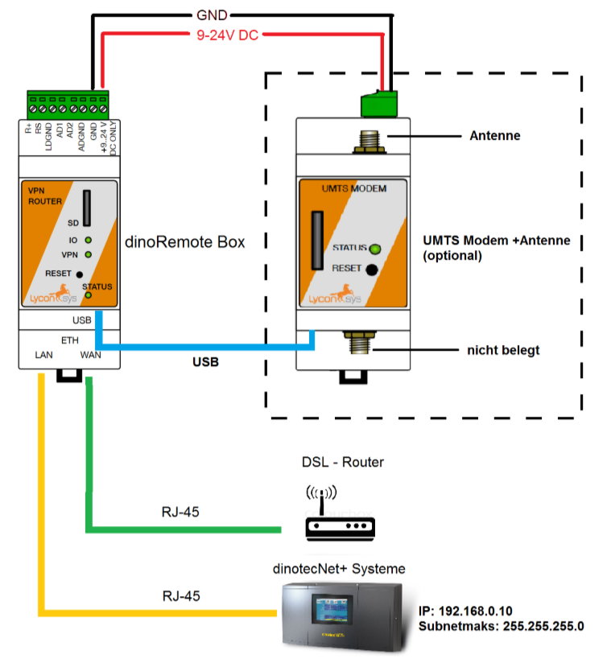
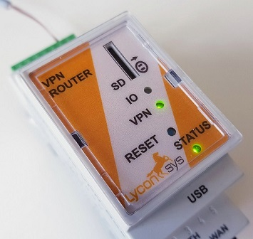
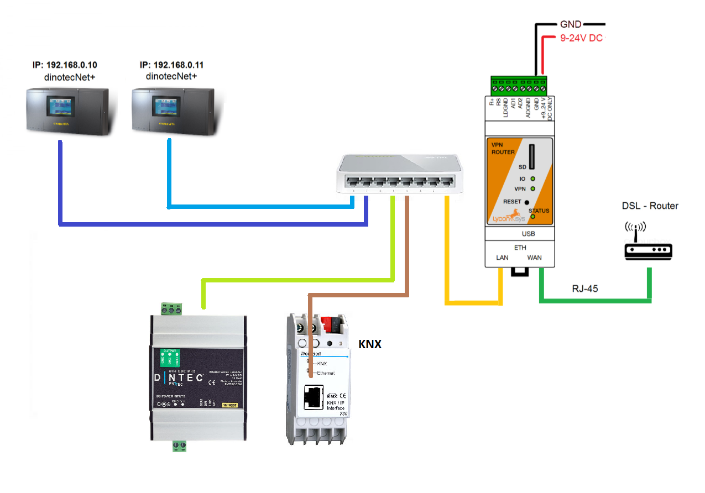

# Technisches

Alle dinotec dinotecNET+ basierten Geräte mit einem Touchbildschirm sind in der Lage, an das **dinoRemote** angebunden zu werden.
Die Kommunikation zum dinoRemote Server erfolgt über einen hochverschlüsselten VPN-Tunnel über das **OpenVPN** Protokoll.
Für den Aufbau des VPN-Tunnels, ist die **dinoRemote Box** erforderlich. Diese nutzt den örtlichen Internetzugang um alle Datenpakete vom dinotecNET+ Gerät, verschlüsselt, zum dinoRemote Server zu übermitteln.

Der Anschluss der dinoRemote Box ist simpel:
Schließen Sie das Netzwerkkabel, welches vom DSL Router kommt, an den **WAN** Port der dRB an. Das Operationspanel (OP57 etc.) der dinotecNET+ Anlage wirsad am **LAN** Port angeschlossen.

  
***

Sobald die dRB mit Strom versorgt ist und mit dem Internet verbunden ist, leuchtet kurz darauf die VPN Lampe auf der Box auf. Dies ist das Zeichen, das die Verbindung zu unserem dinoRemote Server erfolgreich ist. Wenn dies nicht der Fall ist, können sie im Abschnitt Fehlerbehebung nach der Lösung suchen.  
 

   
  

***

# Verbindung mit anderen externen Gateways

Wenn neben der dinoRemote Box noch andere dinotecNet+ Systeme oder Gateways (wie z.B DMX, KNX) benötigt werden, so muss ein Netzwerk Switch verwendet werden. alle Geräte werden an dem Switch angeschlossen, der Switch selber an den **LAN Port** der dinoRemote Box. Aus Sicherheitsgründen dürfen keine fremde Netzwerkgeräte an den Switch angeschlossen werden.

  

# UMTS Anbindung

Für die Anbindung über das Mobilfunknetz gibt es ein eigenes VPN-LTE-Modem. Das oben beschriebene Gerät ist nicht Notwendig. Der Anschluss an eine dinotecNet+ Anlage erfolgt auf dieselbe weise wie die dinoRemote Box für den DSL Anschluss, nur das hier die Verbindung zum Kundenrouter auf der WAN Seite entfällt.

 

   
  

Zur Anbindung per UMTS ist eine SIM-Karte mit Datentarif (min. 1GB/Monat) notwendig. Die SIM-Karte ist vom Betreiber zu stellen.  
Sie können uns die bereits aktivierte Karte auch zusenden und Ihre dinoRemote Box wird fertig eingerichtet an Sie ausgeliefert.  

!> Es ist zwingend notwendig, dass der PIN der SIM-Karte deaktivert ist!

!>  Wir empfehlen stets die stabile Variante per Kabel zu verwenden.  

***

# Fehlerbehebung

**Die VPN Lampe leuchtet nicht**

+ Der DSL Router muss eine IP-Adresse per DHCP vergeben können (falls dies aus technischen Gründen nicht möglich ist, wenden Sie sich bitte an unseren Support).
+ Der VPN Tunnel wird über den Standart OpenVPN Port 1194 hergestellt. Bitte stellen Sie sicher, dass dieser nicht von einer Firewall blockiert wird.
+ Das Kundennetzwerk nutzt ebenfalls die **192.168.0.X** als IP-Range. Sollte dies der Fall sein wenden Sie sich bitte an unseren Support.
+ Verwenden Sie kein sehr langes unabgeschirmtes Netzwerkkabel
+ Verwenden Sie keine Wlan-Adapter oder Powerline-Adapter
+ Überprüfen Sie die ordnungsgemäße Verkabelung
+ Die Datenübertragung ist zu langsam oder kein Empfang (vorwiegend bei UMTS)

**
