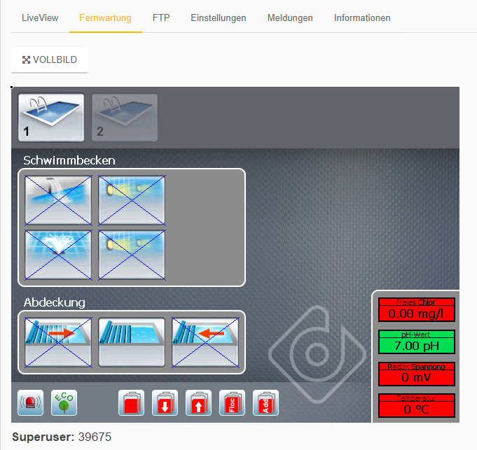

# Fernwartung

Die Fernwartung ermöglicht den direkten Zugriff auf die Anlage. Dabei wird der Bildschirm 1:1 übertragen.
Sie können sich durch die Anlage navigieren, als stünden Sie direkt davor.
Jede Bildschirmänderung wird auch vor Ort ausgeführt.

Sie können die Fernwartung auch im Vollbildmodus ausführen. Klicken Sie hierzu auf "VOLLBILD".
Ein weiterer Browser Tab öffnet sich, und es ist nur der Bildschirm der Anlage zu sehen. Wollen Sie auf Ihrem Monitor echtes Vollbild, so drücken Sie F11 auf Ihrer Tastatur.
Wenn Sie ein weiteres mal F11 betätigigen, wird der Vollbildmodus des Browsers wieder beendet.

Der Super-User Code ist nur für Fachhändler oder dinotec Mitarbeiter sichtbar.