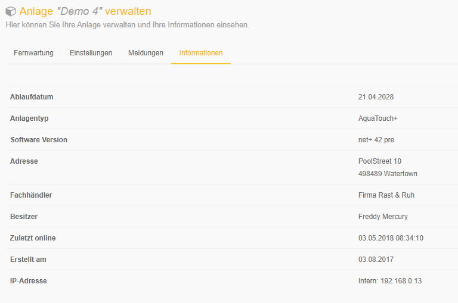

System information

Here you will find various information on the selected system

+ **Expiry date**
Each dinoRemote box has a unique certificate. This ensures a secure connection to the dinoRemote server.
Our certificates will expire after 10 years. The exact date is displayed here. 2 months before expiration a warning appears in this line. Please contact a dinotec employee so that they can create a new scertificate.

+ **System type**
The system type

+ **Software version**
The version of the basic system installed on the system.

+ **Address**
The location of the system

+ **Specialist dealer**
The responsible specialist dealer 

+ **Owner**
The owner of the system

+ **Last online**
The time at which the system was last connected to dinoRemote. The query takes place every 5 minutes.

+ **IP address**
The internal IP address via the dinoRemote establishes the connection to the system. The IP address in the system must be configured according to the one displayed here.