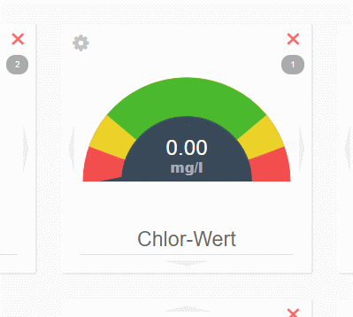

# LiveView

With LiveView you can compile your individual information screen and do not have to navigate through several screens on the system.
This screen is updated automatically every 5 minutes.

There are no modules the first time you use the LiveView.
You can configure your LiveView by clicking on "START EDITING MODE".

---

The LiveView consists of "modules".  
dinotec has prepared some important parameters for easy access.  
  
Please note:***  
LiveView is used exclusively for displaying various values. Control is not possible.

The modules can consist of different displays:  
+ **canister**  
    Displays the fill level of the canister graphically  
+ **Hygenic parameters**  
    Displays a parameter on a color scale  
+ **Bit status**
    Displays individual states  
+ **Register**  
    Displays individual values  

In addition, the circulation to which this information belongs is displayed for each module.  

In the upper area you can search for existing modules.  

You also have the possibility to configure your own modules via the expert mode.
    
**ATTENTION:**  
This function is able to display any information about the system and is only recommended for users who are familiar with the internal structure of the system software. 
The section **Expert Mode** explains the configuration of a module.   
 
 
 
 

## Edit module

some modules offer settings you can change.

With <i class="fa fa-cog fa-lg"></i> you can call the settings of the module and adjust the scale.  
<i class="fa fa-times fa-lg" style="color:red"></i> deletes the current module from the LiveScreen.

## Change name
You can change the name (signature) of the module as you like. Mark the current name and type in a new one.
If you completely delete your own name, the default name is used again. 

  

## Change order

By clicking on the arrows at the edge of each module, you can change the arrangement in the LiveView.  
  

## Expert mode

In expert mode, all available registers from the Net+ system are listed.
Select any tab and then click the <i class="fa fa-cog fa-lg"></i>.
here you have the possibility to configure the display:
Regular register
Displays only the value of the register (if available, with unit)
Hygienic parameters
Displays the value as a colored speedometer
bit status
Shows the state of a single bit in the register.

