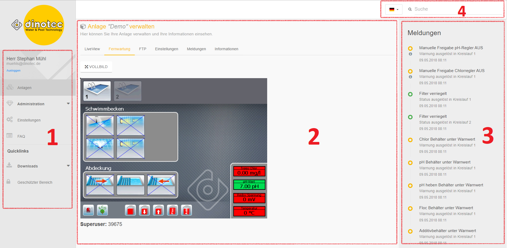
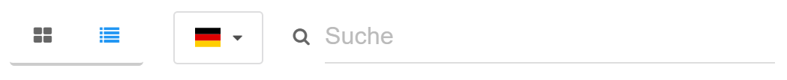
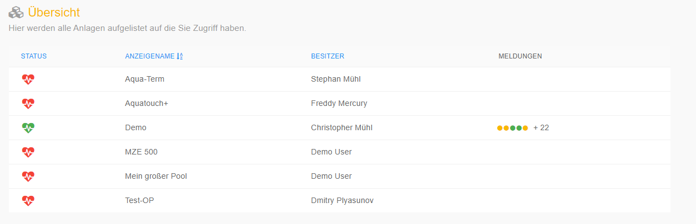
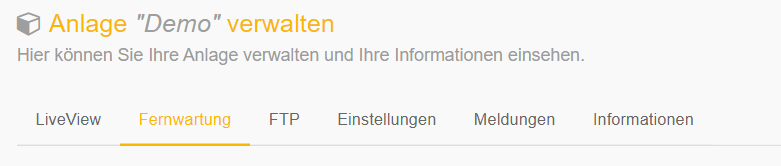

# Navigation

The dinoRemote view is divided into 4 areas

+ *1: Left Sidebar**  
    Here you navigate through dinoRemote. Open the attachment overview, change your account information, etc.
+ **2: Main window**  
    The desired information of the respective page is displayed here.
+ **3: Right Sidebar**  
    The current messages are displayed here in the system overview.
+  **3: Quickbar**   

Switch between tile and list view (only in the system overview or on the dashboard)
Switching the language
Live search: quick search for systems, owners, addresses or system types

### System overview ####
After logging in, you will be directly in the system overview. Here you see all attachments to which you have access.

+ Status : Displays the online / offline status of the system.
+ Display name: Simple name to identify the system
+ Owner: The owner of the facility
+ Messages:      Number of messages accumulated in the system.

### System view ####
To start remote maintenance of a system, select the desired line or tile. They are then routed directly to remote maintenance.
The system view is divided into several functions.

The explanation of each function can be found in the following sections:  
[Remote maintenance](en/vnc)  
[LiveView](en/liveview)  
[Settings](en/settings)  
[Messages](en/email)  
[information](en/info)  
