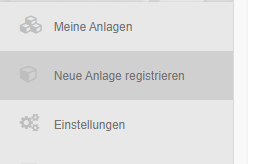

Registration of a new plant

To register a new system you need the 12-digit token on the **dinoRemote Box**.
This token is unique and only fits this box. The next section explains how you can use several systems with one **dinoRemote Box**.

There are 2 ways to register a new system. You will find the menu in the left sidebar.

##### The end customer registers the system
If the end customer does not have a specialist dealer or the end customer wants to register the system himself, the customer can do this via his account. The attachment will then be bound to his account.

After registration, the system is immediately available in the system overview.

##### The dealer registers the system  
The dealer has the option of registering a system either for himself (e.g. private pool or demo system) or for one of his end customers.

After registration, the system is immediately available in the system overview.

***

### Register multiple attachments via a dinoRemote box

it is possible to connect up to 254 systems via one **dinoRemote Box**. Connect all systems to the LAN port of the **dinoRemote Box** via a network switch.
Use the same box token for each registration.
dinoRemote will automatically increment the address internally. Therefore, it is important that you adjust the IP address of each installation so that no IP addresses conflict occurs:  
  

| System        | IP-Adress    |
| ------------- |:-------------:|
| 1             | 192.168.0.10  |
| 2             | 192.168.0.11  |
| 3             | 192.168.0.12  |
| ....          |               |
