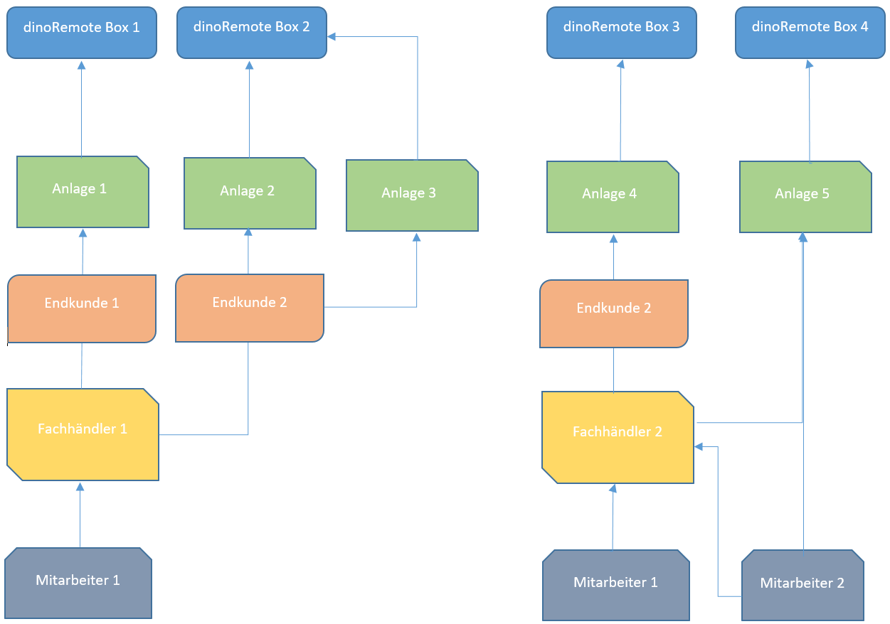

# User roles

the user Hirachie is fixed, exceptions are not possible.
dinoRemote has several user groups and roles:

In the following the structure and the structure of dinoRemote is explained.

At the top is the plant. This can have only one owner.  
The owner of the system is assigned a maximum of one specialist dealer company.   
A dealer can have several users.  
While the owner can only see his own installations, the dealer has access to all the installations assigned to him.  
For data protection reasons it is necessary that the owner actively releases his system for remote maintenance. Otherwise only the Online/Offline status is visible for the specialist dealer or dinotec, all other functions are blocked.  

Possible structure:

