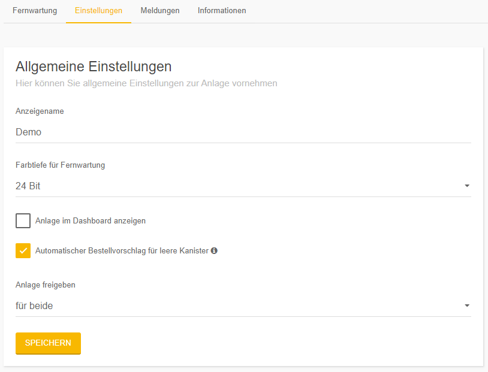

# Settings

Here you will find the general setting for your system.
Many settings are only available for the system owner.  
Each time you make a change, you must save it at the end of the page.

**Display name**  
Change the name of your system. This function is user-specific.
This means that each user can change the name for himself.

**Colour depth for remote control**  
Here you can adjust the color depth of the screen transmission.
We recommend setting the color depth to a lower level for slow bonding.

**Show attachment in dashboard** 
This function is used to list one or more installations on a separate screen.
This is especially useful for outsourcing frequently used systems to get a better overview.
If at least one attachment is displayed in the dashboard, a new selection **Dashboard** appears in the left sidebar, where the attachment then appears.
The systems are still listed in the standard system overview.

**Automatic order proposal for empty canisters** 
This function activates the automatic order proposal. 
(Only available if a specialist dealer is available)
When a canister reaches the warning level, an e-mail is sent to the owner of the installation with a delay of one day.
This indicates that one or more canisters are almost empty. With the button you are directed to an order page of dinoRemote.
Here you have the possibility to adjust your order, to change the quantity and if necessary to order further canisters.
The input mask for the almost empty canister is already prefilled and can be sent directly.
The order will then be sent to the dealer by e-mail.

**Release system**
With this function you release your system for remote maintenance.  
You have the option of  
+ Deactivate the release.
+ Only allow the specialist dealer access.
+ Only allow dinotec access.
+ Allow both of them access.  