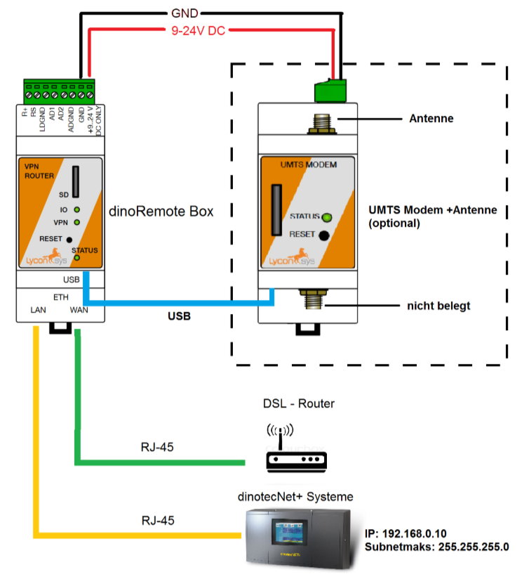

# Communication

All dinotec Net+ based devices with a touch screen are able to be connected to the **dinoRemote**.
The communication to the dinoRemote server takes place via a highly encrypted VPN tunnel via the **OpenVPN** protocol.
The **dinoRemote Box** is required for setting up the VPN tunnel. This uses the local Internet access to transmit all data packets from the dinotec Net+ device, encrypted, to the dinoRemote server.

The connection of the dinoRemote Box (in the following **dRB**) is simple:
Connect the network cable coming from the DSL router to the **WAN** port of the dRB. The operation panel (OP57 etc.) of the Net+ system is connected to the **LAN** port.

  
***

As soon as the dRB is powered and connected to the Internet, the VPN lamp on the box will light up. This is the sign that the connection to our dinoRemote server is successful.
If this is not the case, you can search for the solution in the Troubleshooting section.  
  
***

**UMTS connection**

the dRB can also be connected to the dinoRemote via mobile radio. However, we recommend that you always use the stable version via DSL.  
The optional UMTS modem and a SIM card with data tariff (min. 1GB/month) are required for connection via UMTS. The SIM card must be provided by the operator.  
The modem can be set up by dinotecs before delivery. All you need to do is tell us your APN and provider. You can also send us the already activated card and your dinoRemote box will be delivered to you ready set up.  
Important:*** It is absolutely necessary that the PIN of the SIM card is deactivated!

***

# Troubleshooting

**The VPN lamp is not lit**

+ The DSL router must be able to assign an IP address via DHCP (If this is not possible for technical reasons, please contact our support).
+ The VPN tunnel is established via the standard OpenVPN port 1194. Please make sure that it is not blocked by a firewall.
+ Do not use a very long unshielded network cable.
+ Do not use Wlan adapters or powerline adapters
+ Check the correct cabling
+ Data transmission is too slow (mainly with UMTS)
