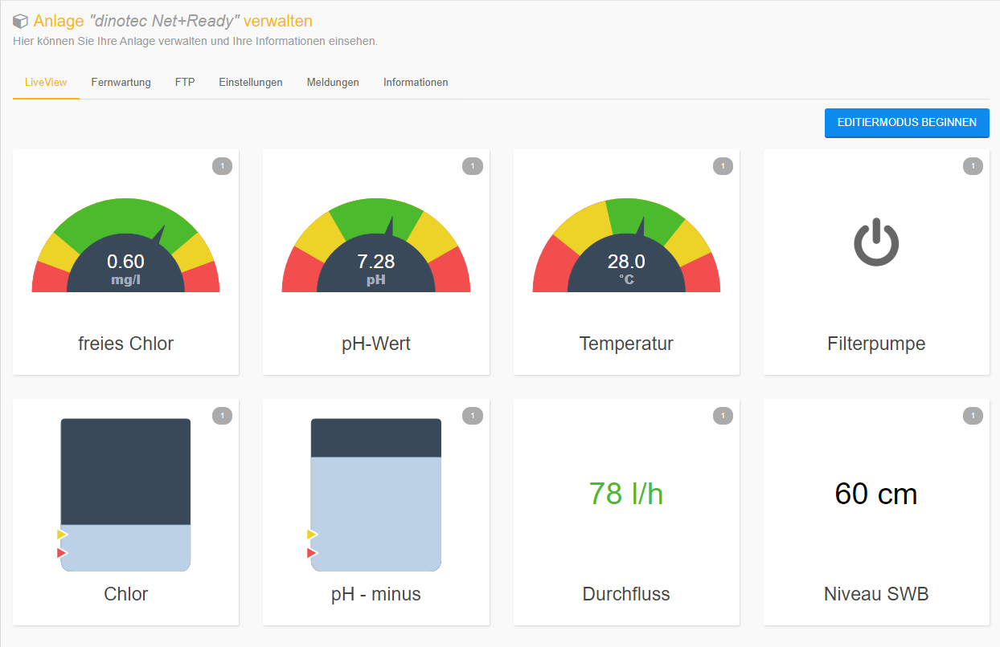
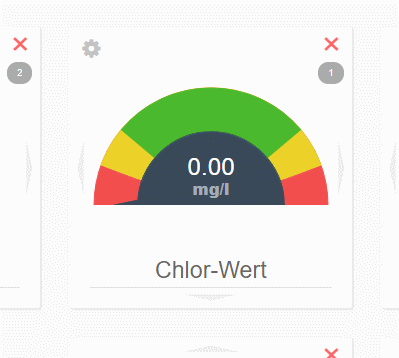
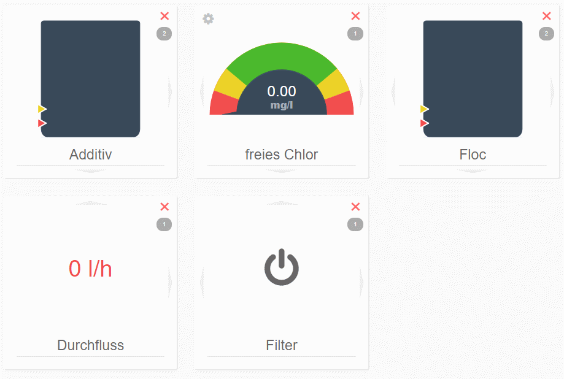

# LiveView

Con el sistema LiveView podrá generar una pantalla personalizada, evitando tener que navegar por las distintas pantallas del equipo para la consulta, actualización y manejo de datos.
La pantalla generad se actualiza de forma automática cada 5 minutos.

En la primera utilización de LiveView no hay ningún módulo disponible.
Con un clic sobre la tecla "EDITIERMODUS BEGINNEN" (Inicio del modo edición) puede empezar a configurarse LiveView.

---

LiveView está constituido por módulos.  
dinotec ha configurado algunos de los parámetros más importantes para facilitar el acceso. 
  
**Rogamos tener en cuenta:**  
La función de LiveView es exclusivamente la de indicar una serie de valores. El equipo no puede manejarse desde LiveView.

Los módulos pueden estar constituidos por diversas indicaciones:
+ **Recipiente**  
    Indica de forma gráfica el nivel de llenado del recipiente  
+ **Parámetros de higiene**  
    Indica una parámetro en el ámbito de una escala coloreada  
+ **Status de bits**  
    Indica individualmente los distintos estados  
+ **Registro**  
    Indica valores individuales  

Además se indica en cada módulo a que circuito hace referencia cada información. 

En el nivel superior podrá encontrar diversos módulos ya programados. 

En el modo de usuario avanzado tendrá también la posibilidad de configurar sus propios módulos.
    
**ATENCIÓN:**  
Con esta función pueden visualizarse todos los parámetros del equipo y se recomienda su uso únicamente a aquellos usuarios familiarizados con el software interno del equipo.  
En el apartado **Usuarios avanzados** se explica cómo configurar un módulo.  
  
    

## Preparación de un módulo

Algunos módulos permitan ajustes que pueden ser cambiados.

Con <i class="fa fa-cog fa-lg"></i> se editan los ajustes del módulo y puede ajustarse, por ejemplo, la escala. 
<i class="fa fa-times fa-lg" style="color:red"></i> permite visualizar el módulo actual desde de LiveScreen.

## Cambio de nombre
El nombre (identificación) del módulo puede cambiarse siempre que sea necesario. Marque el nombre actual e introduzca el nuevo nombre.
Si se borra completamente el nombre el equipo utilizará un nombre predeterminado. 

  

## Cambio de asignación

Pulsando sobre las flechas en el borde del módulo, puede cambiarse la asignación en LiveView. 
  

## Usuarios avanzados

En el modo de usuario avanzado se presenta un listado de todos los registros disponibles del sistema dinotecNET+.
Seleccione el registro deseado y pulse <i class="fa fa-cog fa-lg"></i>.
Aquí se brinda la posibilidad de configurar las indicaciones del equipo.
+ Registro regular
Indica sólo el valor del registro (cuando estén disponibles, también las unidades de medida).
+ Parámetros de higiene
Indica el valor en el ámbito de una escala coloreada.
+ Status de bits
Indica el estado de cada bit individual dentro del registro.

