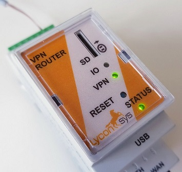

# Comunicación

Todos los equipos con pantalla táctil dinotecNET+ de dinotec pueden conectarse a la aplicación **dinoRemote**.
La comunicación con el servidor dinoRemote se efectúa a través de un túnel cifrado de alta seguridad a través del protocolo **OpenVPN**.
Para la instalación del túnel VPN es necesario disponer de **dinoRemote Box**. Éste utiliza la conexión local de Internet para codificar y enviar los paquetes de datos de los equipos dinotecNET+ al servidor dinoRemote.

La conexión de dinoRemote Box (en adelante **dRB**) es simple:
Conecte el cable procedente del Router DSL al puerto **WAN** del dRB El panel de operaciones (OP57 etc.) del equipo dinotecNET+ debe conectarse al puerto **LAN**.

  
***

Una vez dRB esté conectado a la red eléctrica y a Internet, se encenderá la lámpara VPN del equipo. Esto indica que la conexión al servidor dinoRemote se ha efectuado correctamente.
De no ser así, rogamos consultar el apartado de resolución de errores.  

***

# Conexión UMTS

dRB puede conectarse también vía teléfono móvil al servidor dinoRemote. Se recomienda en cualquier caso efectuar la conexión estable a través de DSL. 
Para conectarse a través de UMTS es necesario disponer del módem UMTS (opcional) así como de una tarjeta SIM con tarifa de datos (de un mínimo de 1 GB/mes). La tarjeta SIM deberá ser adquirida por el usuario. 
La instalación del módem puede ser efectuada por dinotec antes de la entrega del equipo. Para ello solo es necesario que nos comunique el APN y su proveedor de telefonía móvil. También puede hacernos llegar su tarjeta debidamente activada y le entregaremos su dinoRemote Box completamente instalado y configurado. 
**Importante:** Es imprescindible que el PIN de la tarjeta SIM esté desactivado.

***

# Resolución de errores

** La lámpara VPN no se enciende **

+ El router DSL debe poder facilitar una dirección IP a través de DHCP (caso de no ser posible por motivos técnicos, rogamos se ponga en contacto con nuestro equipo de soporte técnico).
+ El túnel VPN se genera a través del puerto standard OpenVPN Port 1194. Asegúrese de que el puerto no está bloqueado por Firewall o algún sistema análogo.
+ Utilice un cable de conexión blindado y no excesivamente largo.
+NO utilice adaptadores WLAN o Powerline.
+ Compruebe que todos los cables estén correctamente conectados.
+ La transmisión de datos es demasiado lenta (principalmente en UMTS).
