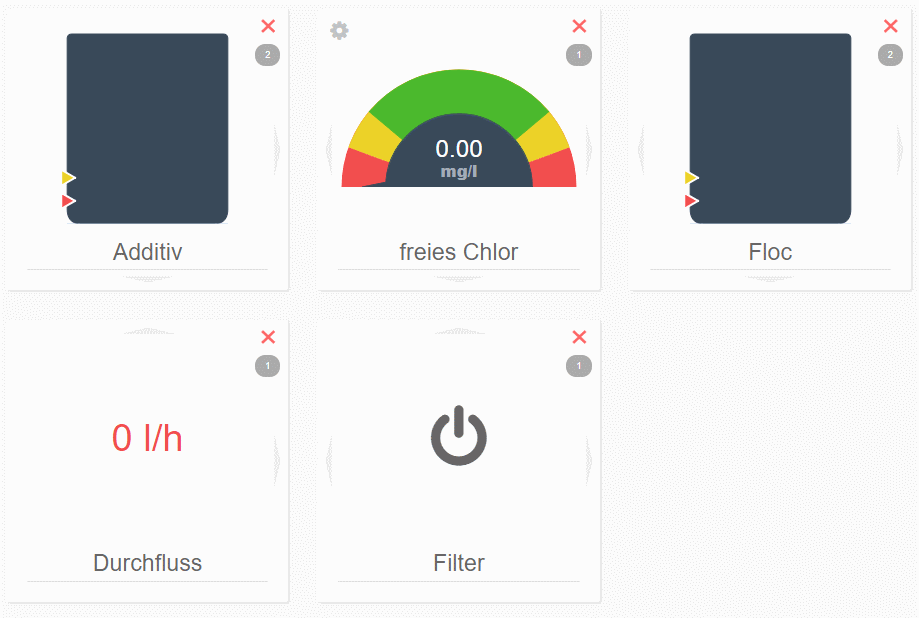

# LiveView

Avec LiveView, vous avez la possibilité d'organiser votre écran d'information personnalisé, vous n'avez donc pas besoin de naviguer entre différents écrans de l'installation.
Cet écran est actualisé automatiquement toutes les 5 minutes.

Lors de la première utilisation de LiveView, aucun module n'est disponible.
En cliquant sur "DÉMARRER MODE ÉDITION", vous pouvez configurer votre LiveView.

---

Le LiveView est composé de "modules".  
Pour faciliter l'accès, dinotec a préconfiguré quelques paramètres importants. 
  
**Veuillez noter :**  
LiveView sert exclusivement à afficher différentes valeurs. Il ne permet pas de commander l'installation.

Les modules peuvent être composés de différents modules :  
+ **Bidon**  
    Représente graphiquement le niveau de remplissage du bidon  
+ **Paramètres d'hygiène**  
    Affiche un paramètre sur une échelle de couleurs  
+ **État de bit**  
    Affiche les états séparément  
+ **Registre**  
    Affiche les valeurs séparément  

En outre, au niveau de chaque module, on peut voir à quel circuit cette information appartient. 

Dans la zone supérieure, vous pouvez rechercher des modules existants. 

Le mode expert vous permet également de configurer vos propres modules.
    
**ATTENTION :**  
Cette fonction, capable de reproduire chaque information de l'installation, est recommandée pour les utilisateurs possédant de très bonnes connaissances de la structure interne du logiciel de l'installation. 
Le paragraphe **Mode expert** comprend des explications pour la configuration d'un module.  
  
    

## Éditer module

Certains modules possèdent des réglages que vous pouvez modifier.

<i class="fa fa-cog fa-lg"></i> vous permet d'appeler les réglages du module et d'ajuster l'échelle par exemple. 
<i class="fa fa-times fa-lg" style="color:red"></i> efface le module actuel du LiveScreen.

## Modifier le nom
Vous avez la possibilité de modifier le nom (signature) du module à votre convenance. Sélectionnez le nom actuel et saisissez un nouveau nom.
Si vous effacez entièrement votre propre nom, le nom par défaut est à nouveau utilisé. 

  

## Modifier la disposition

En cliquant sur les flèches situées au bord de chaque module, vous avez la possibilité de modifier la disposition dans LiveView. 
  

## Mode expert

En mode expert, tous les registres disponibles du système dinotecNET+ sont listés.
Choisissez un registre de votre choix, puis cliquez sur le <i class="fa fa-cog fa-lg"></i>.
Vous avez ici la possibilité de configurer l'affichage :
+ Registre ordinaire
Affiche uniquement la valeur du registre (le cas échéant avec l'unité)
+ Paramètres d'hygiène
Affiche la valeur en tant que tachymètre en couleur
+ État de bit
Affiche l'état de chaque bit dans le registre.

