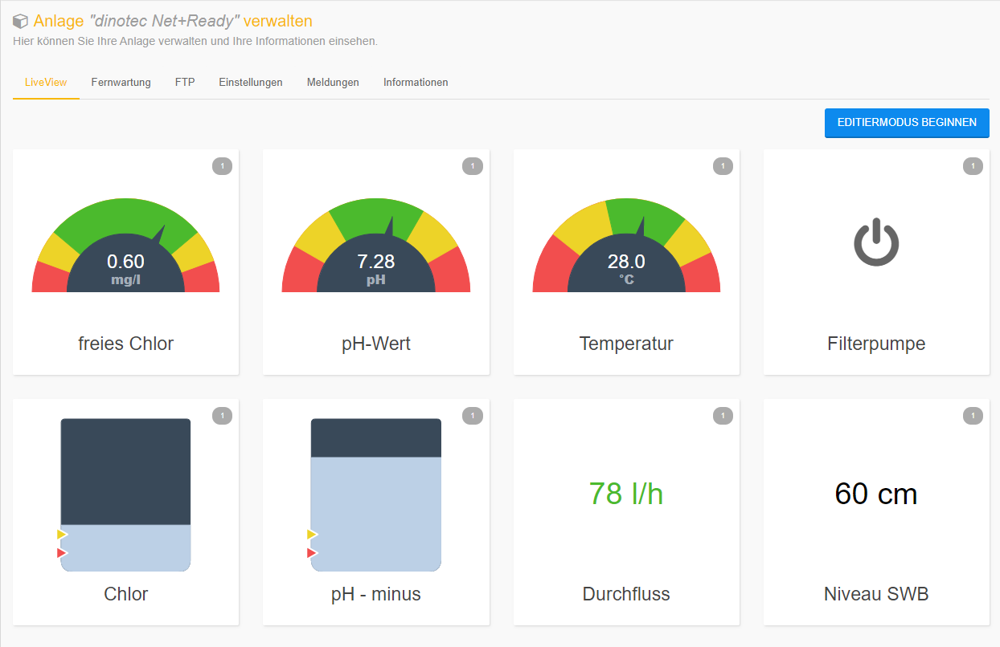

# LiveView

Mit LiveView können Sie sich ihren Individuellen Informations-Bildschirm zusammenstellen und müssen sich nicht durch mehrere Bildschirme auf der Anlage navigieren.
Dieser Bildschirm wird alle 5 Minuten aqutomtisch aktualisiert.

Bei der ersten Verwendung des LiveViews sind keine Module vorhanden.
Durch ein klick auf "EDITIERMODUS BEGINNEN" können Sie sich Ihren LiveView konfigurieren.

---

Das LiveView besteht aus "Modulen".  
dinotec hat für den einfachen Zugriff einige wichtige Parameter vorgefertigt.  
  
**Bitte beachten Sie:**  
LiveView dient ausschließlich zu Anzeige verschiedener Werte. Eine Steuerung ist nicht möglich.

Die Module können aus verschiedenen Anzeigen bestehen:  
+ **Kanister**  
    Zeigt den Füllstand des Kanisters grafisch an  
+ **Hygeneparameter**  
    Zeigt einen Parameter auf einer Farbskala an  
+ **Bitstatus**  
    Zeigt einzelne Zustände an  
+ **Register**  
    Zeigt einzelne Werte an  

Zudem wird bei jedem Modul angezeigt, zu welchem Kreislauf diese Information gehört.  

Im oberen Bereich können Sie nach vorhanden Modulen suchen.  

Sie haben auch über den Expertenmodus die Möglichkeit ihre eigenen Module zu Konifgurieren.
    
**ACHTUNG:**  
Diese Funktion ist in der Lage jede Infomrationen der Anlage abzubilden und ist nur Benutzern empfohlen die sich mit dem internen Aufbau der Anlagensoftware auskennen. 
Im Abschnitt **Experten Modus** wird die Konfiguration eines Moduls erklärt.   
  
    

## Modul bearbeiten

einige Module bieten Einstellungen die Sie ändern können.

Mit <i class="fa fa-cog fa-lg"></i> rufen Sie die Einstellungen des Moduls auf, und können damit z.B die Skala anpassen.  
<i class="fa fa-times fa-lg" style="color:red"></i> löscht das aktuelle Modul aus dem LiveScreen.

## Namen  ändern
Sie können den Namen (Unterschrift) des Moduls beliebig ändern. Makieren Sie den aktuellen Namen und tippen Sie einen neuen ein.
Wenn sie den eigenen Namen komplett löschen, so wird wieder der Standartname verwendet. 

  

## Anordnung ändern

Durch Klicken auf die Pfleile die sich am Rand jedes Moduls befinden, können die die Anordnung im LiveView ändern.  
  

