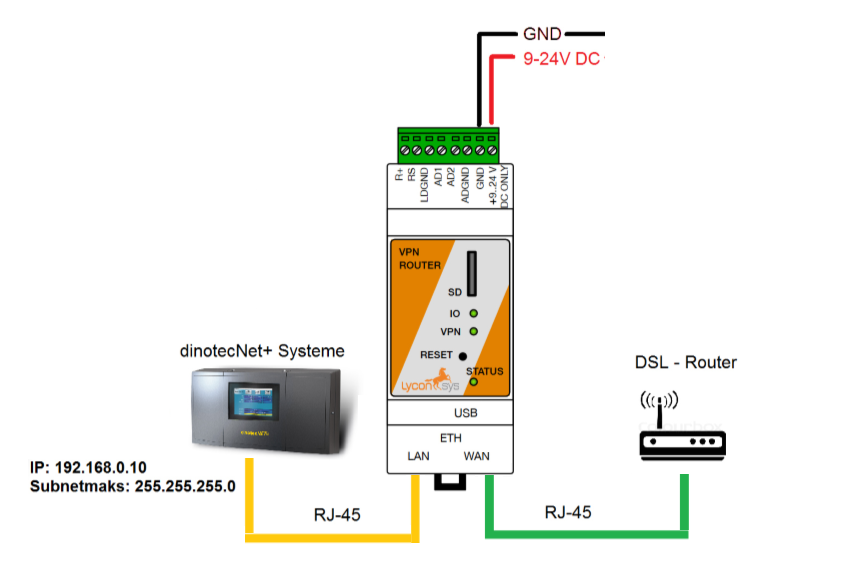

# Kommunikation

Alle dinotec Net+ basierten Geräte mit einem Touchbildschirm sind in der Lage an das **dinoRemote** angebunden zu werden.
Die Kommunikation zum dinoRemote Server erfolgt über einen hochverschlüsselten VPN-Tunnel über das **OpenVPN** Protokoll.
Für den Aufbau des VPN-Tunnels, ist die **dinoRemote Box** erforderlich. Diese nutzt den örtlichen Internetzugang um alle Datenpakete vom dinotec Net+ Gerät, verschlüsselt, zum dinoRemote Server zu übermitteln.

Der Anschluss der dinoRemote Box (im folgenden **dRB**) ist simpel:
Schließen Sie das Netzwerkkabel, welches vom DSL Router kommt, an den **WAN** Port der dRB an. Das Operationspanel (OP57 etc.) der Net+ Anlage wird am **LAN** Port angeschlossen.

  
***

Sobald die dRB mit Strom versorgt ist und mit dem Internet verbunden ist, leuchtet kurz darauf die VPN Lampe auf der Box auf. Dies ist das Zeichen, das die Verbindung zu unserem dinoRemote Server erfolgreich ist.
Wenn dies nicht der Fall ist, können sie im Abschnitt Fehlerbehebung nach der Lösung suchen.  
  
***

# UMTS Anbindung

die dRB kann ebenso über Mobilfunk an das dinoRemote angebunden werden. Wir empfehlen jedoch stets die stabile Variante über DSL zu verwenden.  
Zur Anbindung per UMTS ist das optionale UMTS Modem sowie eine SIM-Karte mit Datentarif (min. 1GB/Monat) notwendig. Die SIM-Karte ist vom Betreiber zu stellen.  
Die Einrichtung des Modems kann von seiten dinotecs bereits vor der Auslieferung erfolgen. Hierzu genügt es wenn Sie uns APN und Provider mitteilen. Sie können uns die bereits aktiverte Karte auch zusenden und Ihre dinoRemote box wird fertig eingerichtet an Sie ausgeliefert.  
**Wichtig:** Es ist zwingend notwendig das der PIN der SIM-Karte deaktivert ist!

***

# Fehlerbehebung

** Die VPN Lampe leuchtet nicht **

+ Der DSL Router muss eine IP-Adresse per DHCP vergeben können (Falls dies aus technischen Gründen nicht möglich ist, wenden Sie sich bitte an unseren Support).
+ Der VPN Tunnel wird über den Standart OpenVPN Port 1194 hergestellt. Bitte stellen Sie sicher das dieser nicht von einer Firewall blockiert wird.
+ Verwenden Sie kein sehr langes unabgeschirmtes Netzwerkkabel
+ Verwenden Sie keine Wlan-Adpater oder Powerline-Adapter
+ Überprüfen Sie die ordnungsgemäße Verkabelung
+ Die Datenübertragung ist zu langsam (Vorwiegend bei UMTS)
